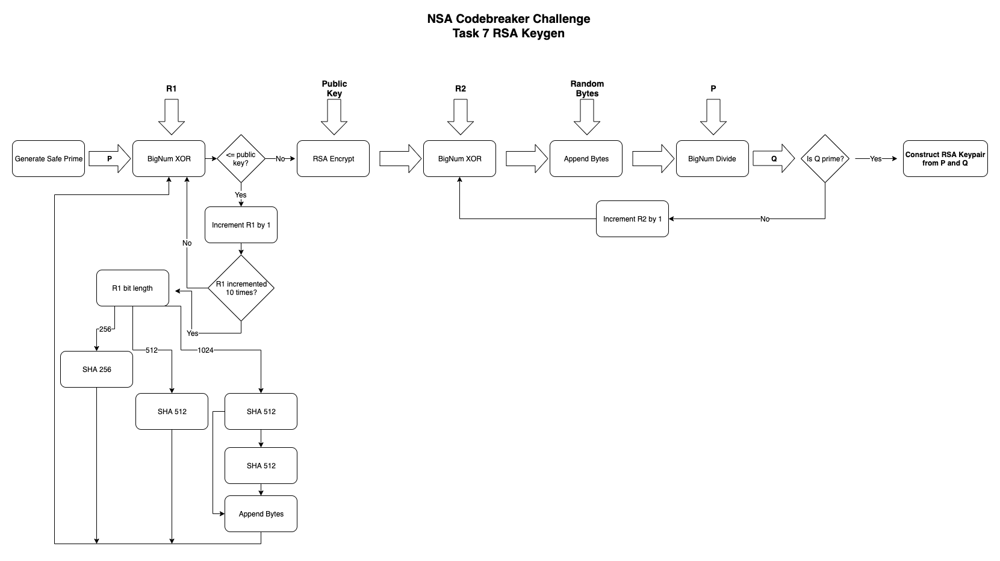
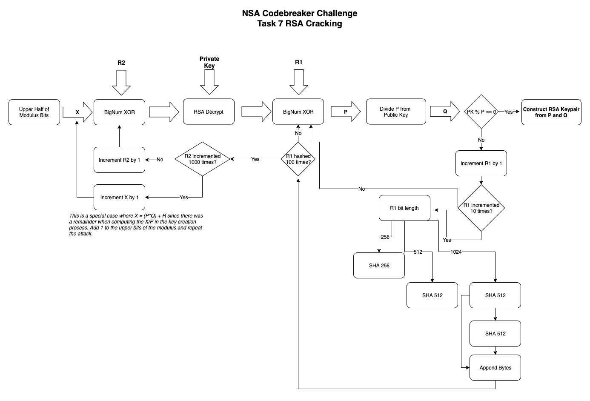
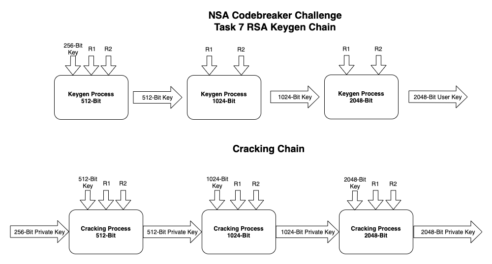
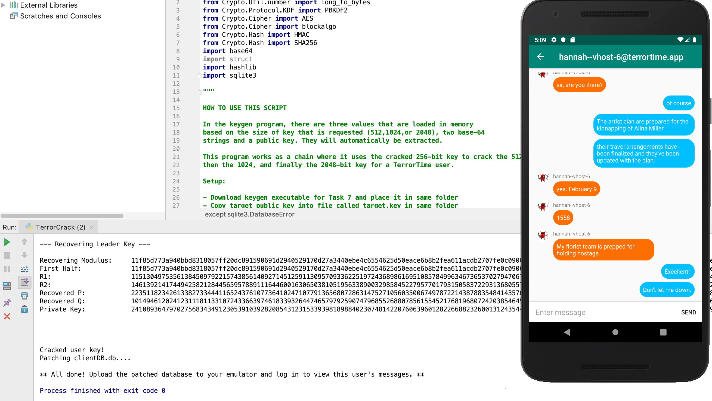

# Task 7 Writeup

## Task Description

The arrested terrorist (see Task 3) was not cooperative during initial questioning. He claimed we’d never defeat the underlying cryptography implemented in TerrorTime and the only way to read encrypted messages was if you were one of the communicants. After additional questioning, he revealed that he is actually the lead software developer for TerrorTime and the organization leader directed him to provide a secret way of decrypting and reading everyone's messages. He did not divulge how this was possible, but claimed to have engineered another, more subtle weakness as an insurance policy in case of his capture. After receiving this information, the analysts who found TerrorTime on the suspect’s mobile device mentioned seeing an executable called keygen on his laptop. The terrorist confirmed it is an executable version of the library included with TerrorTime. They have shared a copy of the keygen executable for you to reverse engineer and look for potential vulnerabilities. As expected from the terrorist's statement, the chats stored on the server are all encrypted. Based on your analysis of keygen, develop an attack that can decrypt any TerrorTime message, including those sent in the past, and use this capability to decrypt messages from the organization leader to other cell leaders. Completing task 4 and task 5 are recommended before beginning this task. To prove task completion, submit the following information:

* Plaintext version of the latest encrypted message from the organization leader
* Enter the future action (i.e., beyond the current one) they are planning
* The target (of the terrorist action’s) identity (First and Last Name)
* The location where the action is to take place
* Enter the action planned by the terrorists

## Provided Files

* TerrorTime Key Generator (keygen)

## Walkthrough

Ok! We're finally down to the final task! As you recall from all of the previous tasks, we have been looking at a lot of encrypted messages but have no way to read the plain text without being able to somehow figure out the private keys of the users (Not computationally feasible normally). However, for this task we have been told that the developer for the organization hid a vulnerability in the library used to generate RSA keys in the app. If you check out my reverse engineering video below you can see how I discovered the weakness, however I will just give you the big points here. I definitely recommend digging into it in IDA or another debugger yourself.

### R Keys

If you look into the functions of this program, one of the first things you'll see is that there is a function called "select_key_params" which loads some values into memory based on the size of key being generated (since this keygen can create a 512, 1024, or 2048 bit key.

These values are a public key in PEM format, along with two base-64 strings for each key size (so six in total). The public key modulus is loaded from the PEM and then the base-64 strings are converted to integers (which we'll call R1 and R2). Each of these are half the bit length of the key being created.

### Key Generation Process

Once the program gets to the actual key generation function, it follows the algorithm below:

In the beginning, the function creates a prime number P that is half the bit length of the requested key. Then it XORs this number with R1, if that output is less than the modulus of the public key then it adds 1 to R1 and tries again. After ten iterations, then it hashes R1 with a function based on the key size.

Next, it encrypts the XOR output using the public key, then XORs it again with R2. Then it appends random bytes, the same size as the XOR output to it, creating a large number we call X.

Finally, it divides P from X to get Q. If Q is a prime number, then P and Q are used to generate the keypair for output to the user. Otherwise, it adds 1 to R2 and tries again.

The part that is interesting is that if X/P = Q then P * Q = X. Meaning that X equals the public key modulus of the outputted key. This means that every public key in the TerrorTime organization is actually just the prime factor P in an obfuscated form, with some random bytes attached to make it more random. This also means that the process is reversible!

### Key Cracking Process

If we look at the algorithm above, and having the original R keys and public key from the keygen executable, we are able to deduce a reversal process which reveals the original prime factor of the key and allows us to create its private key.

The only problem with this is....if we need to decrypt the output at one point, then how do we know the private key to use? What if all of the keys included in the keygen executable are generated using the same method? As it turns out, that is exactly the case!

### Chain Process

All of the public keys that are used in the program were generated in a chain, meaning that if we want to reverse this process, we can also break them in a chain. This reduces the difficulty of the problem greatly because we only actually need to manualy factor the smallest 256-bit key.

To factor the smallest key, we can use a program like [Yafu](https://github.com/DarkenCode/yafu) to easily factor the modulus in about 3-5 minutes using advanced methods. Using these factors, we can generate a private key for the lowest key size.

Putting this private key into the reversal algorithm described above, we are able to find the private key for the 512 bit key, then repeat that again for the 1024 bit key, and then finally for the 2048 bit TerrorTime user key.

See [TerrorCrack.py](TerrorCrack.py) for an implementation of this cracking process.

### Database Encryption

If you look at the clientDB file, you'll notice that while the public key is in plain text, the private key appears to be encoded in some way where we can't read or modify it. If you take time to decompile the original APK, you'll find the function encryptClientBytes() in Client.java. This function uses PBKDF2 with HMAC SHA-256 to create a key based on the 6-digit user pin and then uses that key to AES encrypt the input. So if you know the pin that you are going to log in with, you can recreate this function yourself and encrypt the private key PEM from the cracking process before inserting it into the DB. (TerrorCrack script does this automatically)

### Gathering Intel

Once you have the clientDB set up with the username, public key, and encoded private key of the top leader, you can upload it to the emulator and log in. This will allow the app to successfully decrypt all of their messages and you can begin gathering intel. Most of the tasks are straightforward except for the action location, which may be hidden in one of the conversations of a cell leader with their underling. You can easily repeat this cracking process for other users and read everything that you need!

Once you have gathered all of the information, go ahead and submit and **you're finally finished!** Grats on successfully breaking the challenge and taking down the TerrorTime organization!

## Walkthrough Videos
https://www.youtube.com/watch?v=dNoKYR8KRd4

https://www.youtube.com/watch?v=o7o78oQD30w

